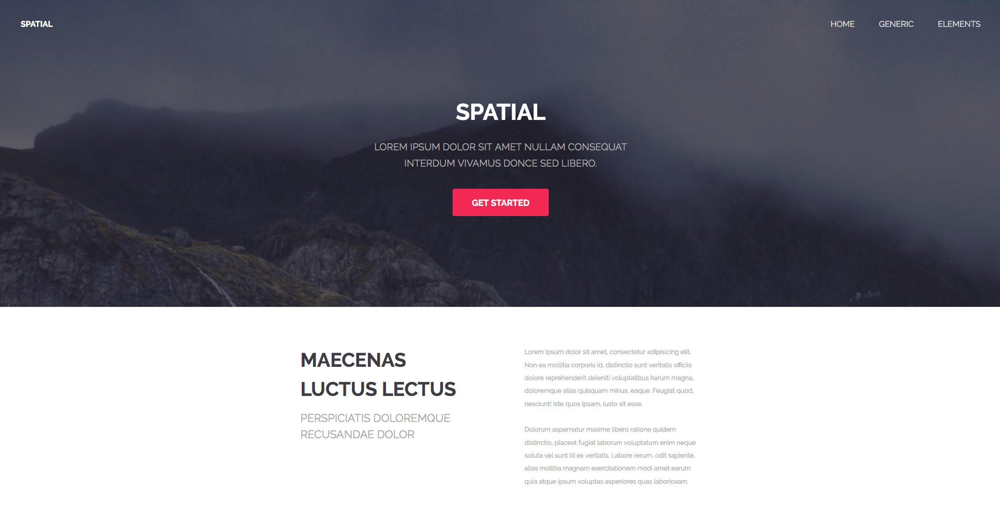

# Spatial

A simple, spacious, minimalistic design topped off with a large cover image.

Inspired by: [https://templated.co/spatial](https://templated.co/spatial)

---

## Setup

1. Clone or download repository.
2. Open `index.html` file using local or file server.

---

### Use case

- Setting up a new **vanilla HTML & CSS** project
- Re-design *[original](https://templated.co/spatial)* template by replacing floats with **Flexbox** and **Grid**
- Improving typography with **Google Fonts**
- Using **FontAwesome 5** icon library
- Separating concerns into 2 groups (core and specific theme) for the faster prototyping
- Extensive use of modern **CSS variables**

---

*Made for students of UJEP (Univerzita Jana Evangelisty Purkyně in Ústí nad Labem who are specializing in computer science degree.*
